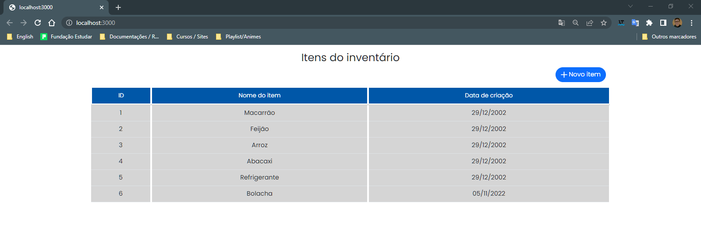
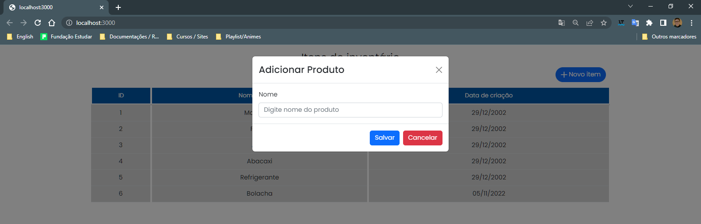
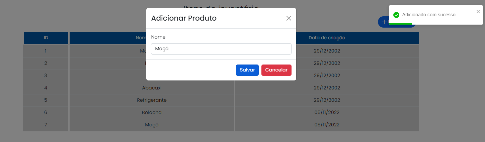

# Projeto: Inventário React & Python

  <a href="#sobre">Sobre o Projeto ℹ️</a>&nbsp;&nbsp;&nbsp;
  <a href="#tecno">Tecnologias 🚀</a>&nbsp;&nbsp;&nbsp;
  <a href="#instrucoes">Instruções / Tutorial 🎓</a>&nbsp;&nbsp;&nbsp;
  <a href="#referencias">Referências 🔗</a>  

 

### Sobre ℹ️

Interface para manuseio dos itens cadastrados utilizando framework React JS, Web API Flask e Python.

[Voltar ⬆️](#indice)

 

### Tecnologias 🚀

- React JS 
- Python 
- React Bootstrap
- Axios
- React Toastify

[Voltar ⬆️](#indice)

 

### Instruções / Tutorial 🎓

#### Como Clonar

* Faça **fork** do projeto

* Escolha a url para clone e copie

* Em seu terminal, execute o comando complentando a url clone

      git clone urlExemplo

#### Executando Backend para disponibilizar a Web API

* Com seu terminal, entre na pasta **backend** e ative o script da máquina virtual:
  > Windows e usando terminal PowerShell

      venv\Scripts\activate

* Depois da ativação, execute o arquivo **"main.py"** com o comando:

      python main.py

>*NOTA:* A executação pode ser realizada com auxílio de uma IDE como VSC ou PyCharm que são as mais comuns para py, contudo é importante que elas reconheçam meu arquivo **"main.py"** para executar. 

#### Consumindo Web API no Frontend

* Após executar a Web API no backend, entre com outra sessão do seu terminal na pasta **frontend** e execute: 

    npm start

* Eu seu browser acesse a url:

    http://localhost:3000/

    

### Como Usar

#### Para adicionar um novo produto

* Aperte o botão adicionar item

- Escreva um nome de um produto:
    - Não seja vázio, espaço ou nulo 

* Aperte o botão cancelar ou o ícone **"X"** para desistir de adicionar e fechar o modal 

[Voltar ⬆️](#indice)

 

### Referências 🔗

- Como criar uma Api com Flask + Python - #019 - Api Rest com Python + Flask - [PycodeBR](https://www.youtube.com/watch?v=LP8besicfH4)

[Voltar ⬆️](#indice)
